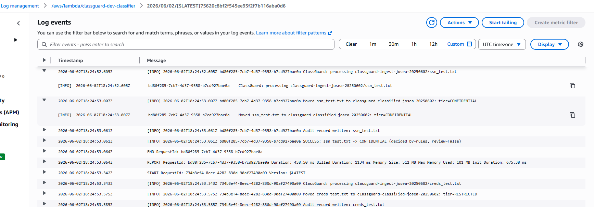

# ClassGuard: Automated Data Classification & Label Enforcement on AWS

A GRC engineering project that implements automated data classification at point-of-creation, enforces metadata labels across pipelines, and maintains an immutable audit trail. Built for AWS with Terraform, Python, and Bedrock AI.

**Live, tested pipeline.** Deploy in ~5 minutes. No PII stored. Audit-ready.

---

## The Problem

Federal agencies and contractors must classify data at creation and prevent unlabeled data from flowing into pipelines. Today:
- Classification is manual, inconsistent, and audit-invisible
- Labels don't travel with files
- Compliance teams have no ledger
- No automated response to misclassified or sensitive data

ClassGuard solves this with **rules-based + AI-augmented classification**, **S3 metadata enforcement**, and **DynamoDB audit trail**.

---

## What It Does

```
File Uploaded to Ingest Bucket
         ↓
   EventBridge Trigger
         ↓
   Lambda Classifier
     ├─ Rules Engine (SSN, email, CUI markers, etc.)
     └─ Bedrock AI (optional, augments rules)
         ↓
   Classification Decision
     ├─ Tier: PUBLIC → INTERNAL → CONFIDENTIAL → RESTRICTED
     └─ CUI flags, confidence, audit rationale
         ↓
   Enforce Labels
     ├─ S3 object tags
     ├─ DynamoDB audit record
     └─ SNS alert on failure
         ↓
   Pipeline Compliance
     ├─ Classified bucket: accept tagged objects
     ├─ Quarantine bucket: hold unclassified/failed
     └─ Ingest bucket: refuse unlabeled data
```

---

## Key Features

**Deterministic Rules Engine**
- Patterns: SSN (with checksum), credit cards (Luhn validation), emails, AWS keys, private keys, secrets
- CUI markers: FOUO, NOFORN, "CONTROLLED UNCLASSIFIED INFORMATION", etc.
- FIPS-199 impact levels: LOW/MODERATE/HIGH → classification tiers
- **Never stores matched values** — only counts and types for compliance

**AI Augmentation (Optional)**
- AWS Bedrock Converse API integration
- Raises classification when AI has high confidence
- Holds floor when rules already classified higher (never downgrades)
- Configurable confidence threshold
- Audit rationale included

**Enforcement & Audit**
- S3 object tags: `classification=INTERNAL`, `review=False`, etc.
- DynamoDB ledger: object key, timestamp, classification, decided_by, rationale
- SNS alerts on classification failure or quarantine
- Bucket policies prevent unlabeled data from leaving ingest

**Production-Ready**
- KMS encryption at rest (S3, DynamoDB)
- EventBridge for event-driven architecture
- 60-second Lambda timeout, 512 MB memory
- Fail-closed: errors quarantine objects and alert
- Terraform Infrastructure-as-Code, fully tagged, stateless

---

## NIST 800-53 Control Alignment

This project implements or supports:

| Control | Purpose | Implementation |
|---------|---------|-----------------|
| **AC-16** | Security Attributes | S3 object tags as classification labels |
| **AC-4** | Information Flow Enforcement | Bucket policies, Lambda refuses untagged data |
| **RA-2** | Security Categorization | Classification taxonomy (PUBLIC → RESTRICTED) |
| **MP-3** | Media Marking | Metadata on objects at creation |
| **AU-2 / AU-12** | Audit Events | DynamoDB immutable ledger + SNS alerts |
| **SC-12 / SC-28** | Key Management & Encryption | KMS CMK for S3/DynamoDB |

See [docs/CONTROL-MAPPING.md](docs/CONTROL-MAPPING.md) for detailed control mapping.

---

## Architecture

```
┌─────────────────────────────────────────────────────────────┐
│                     ClassGuard Architecture                 │
├─────────────────────────────────────────────────────────────┤
│                                                             │
│  Ingest Bucket (EventBridge enabled)                       │
│       │                                                    │
│       └──→ S3:ObjectCreated event                         │
│            │                                              │
│            └──→ EventBridge Rule                          │
│                 │                                         │
│                 └──→ Lambda Function                      │
│                      ├─ Read object from Ingest          │
│                      ├─ Run Classification Engine         │
│                      │  ├─ Rules (deterministic)          │
│                      │  └─ AI (Bedrock, optional)         │
│                      ├─ Tag object                        │
│                      ├─ Route to:                         │
│                      │  ├─ Classified (success)           │
│                      │  └─ Quarantine (failure)           │
│                      └─ Write audit → DynamoDB            │
│                      └─ Alert → SNS (on failure)          │
│                                                            │
│  KMS Key (encrypts S3 & DynamoDB)                         │
│  DynamoDB Audit Table (PAY_PER_REQUEST)                   │
│  SNS Topic (email alerts)                                 │
│                                                            │
└─────────────────────────────────────────────────────────────┘
```

---

## Quick Start

### Prerequisites
- AWS Account (uses Free Tier + $200 credits)
- Terraform >= 1.0
- AWS CLI v2 configured
- Python 3.12 (for local testing)

### Deploy

```bash
cd terraform/

# Create terraform.tfvars (copy from example)
cp terraform.tfvars.example terraform.tfvars
# Edit terraform.tfvars: bucket names, email, etc.

# Initialize and deploy
terraform init -upgrade
terraform plan
terraform apply

# Confirm SNS subscription email
```

**Output:** Bucket names, Lambda ARN, DynamoDB table, SNS topic ARN

### Test the Pipeline

```bash
# Create a test file with an email (will be classified INTERNAL)
echo "Contact: alice@example.com" > test.txt

# Upload to ingest bucket
aws s3 cp test.txt s3://YOUR-INGEST-BUCKET/

# Watch it execute
aws logs tail /aws/lambda/classguard-dev-classifier --follow

# Check tags on classified object
aws s3api get-object-tagging --bucket YOUR-CLASSIFIED-BUCKET --key test.txt

# Query audit trail
aws dynamodb scan --table-name classification-audit
```

---

## Live Execution

### S3 Classified Bucket with Tags
Real objects tagged by ClassGuard showing classification, impact level, and categories:


### DynamoDB Audit Trail
Every classification decision logged with object key, tier, confidence, and rationale:


### CloudWatch Logs
Real-time Lambda execution showing classification decisions:



### Git Commit History
Complete build history from rules engine to production infrastructure:


---

## Classification Tiers

| Tier | FIPS-199 Impact | Rules Match | Examples |
|------|-----------------|-------------|----------|
| **PUBLIC** | LOW | No patterns matched | Marketing, public docs |
| **INTERNAL** | LOW | Email addresses, phone numbers | Employee directories, contact info |
| **CONFIDENTIAL** | MODERATE | PII (SSN, credit cards), CUI markers (FOUO) | Personal data, financial records |
| **RESTRICTED** | HIGH | Secrets (AWS keys, private keys, NOFORN) | Credentials, classified data |

**AI augmentation:** If Bedrock confidence ≥ threshold, raises by one tier. Never downgrades.

---

## Configuration

Set in `terraform.tfvars` or Lambda environment:

```hcl
# Classification
ai_confidence_threshold     = 0.6  # Min confidence to raise tier
max_object_size_bytes       = 1048576  # 1 MB default

# Bedrock (optional)
bedrock_enabled             = false
bedrock_model_id            = ""  # e.g., "us.anthropic.claude-sonnet-20250514"

# Notifications
alert_email                 = "your-email@example.com"  # SNS subscription
```

---

## Compliance & Audit

**What's logged:**
- Every object processed (success/failure)
- Classification decision and rationale
- AI confidence (if enabled)
- Timestamp, object key, bucket
- "decided_by" flag (rules, ai-raised, ai-low-confidence, rules+ai)

**What's NOT logged:**
- Matched PII values (only counts)
- Raw file contents
- Decrypted secrets

**Queries:**

```bash
# List all RESTRICTED files
aws dynamodb query --table-name classification-audit \
  --index-name classification-index \
  --key-condition-expression "classification = :tier" \
  --expression-attribute-values '{ ":tier": { "S": "RESTRICTED" } }'

# Files that triggered review
aws dynamodb query --table-name classification-audit \
  --key-condition-expression "review_recommended = :flag" \
  --expression-attribute-values '{ ":flag": { "BOOL": true } }'
```

---

## Project Structure

```
classguard/
├── README.md                          (this file)
├── docs/
│   ├── CONTROL-MAPPING.md             (NIST 800-53 alignment)
│   └── IMPLEMENTATION.md              (deep dive)
│
├── src/classifier/
│   ├── rules.py                       (pattern detection)
│   ├── bedrock.py                     (AI augmentation)
│   ├── classify.py                    (orchestrator)
│   └── handler.py                     (Lambda entrypoint)
│
├── terraform/
│   ├── main.tf                        (provider, locals)
│   ├── variables.tf                   (input variables)
│   ├── s3.tf                          (buckets, encryption)
│   ├── dynamodb.tf                    (audit table)
│   ├── iam.tf                         (roles, policies)
│   ├── lambda.tf                      (function, permissions)
│   ├── eventbridge.tf                 (S3→Lambda trigger)
│   ├── sns.tf                         (alerts)
│   ├── outputs.tf                     (exported values)
│   ├── terraform.tfvars.example       (template)
│   └── .terraform.lock.hcl            (provider versions)
│
└── .gitignore                         (secrets, local)
```

---

## Development & Testing

### Local Classification Test

```python
from src.classifier.rules import RuleEngine
from src.classifier.classify import Classifier

# Test deterministic classification
engine = RuleEngine()
result = engine.scan("From: alice@example.com")
print(result)  # ScanResult(tier=INTERNAL, cui_flags=[], ...)

# Full classification pipeline
classifier = Classifier(rules_engine=engine)
classification = classifier.classify(file_content="SSN: 123-45-6789")
print(classification.tier)  # RESTRICTED
print(classification.as_tags())  # {'classification': 'RESTRICTED', 'review': 'False'}
```

### Deploy Updates

```bash
# Update Python code
# → Push to git
# → Terraform will re-archive and redeploy Lambda

terraform plan
terraform apply
```

---

## Known Limitations

- **Max file size:** 1 MB (configurable)
- **Max AI scan:** 8000 characters (Bedrock token limits)
- **DynamoDB:** PAY_PER_REQUEST billing (fine for dev/test)
- **No ML training:** Uses rule patterns + Bedrock only
- **Single region:** Deployed to one AWS region only

---

## Security Considerations

**Data Protection**
- KMS CMK encryption for all data at rest
- Bucket versioning enabled
- Object tagging immutable (tagged via Lambda copy)

**IAM Principle of Least Privilege**
- Lambda role: read ingest, write classified/quarantine, audit to DynamoDB, KMS operations only
- EventBridge role: invoke Lambda only

**Audit & Monitoring**
- All events logged to DynamoDB
- SNS alerts on failures (email)
- CloudWatch logs retention: 7 days

**Considerations for Production**
- Enable MFA Delete on audit table
- Use VPC endpoints for S3/DynamoDB to isolate traffic
- Implement cross-account audit bucket for immutability
- Add Macie for suspicious activity detection
- Enable S3 Object Lock for WORM compliance

---

## Contributing

This is a reference implementation. To extend:
1. Add custom patterns to `rules.py`
2. Adjust classification tiers in `classify.py`
3. Modify bucket policies in `s3.tf`
4. Update control mapping in `docs/CONTROL-MAPPING.md`

---

## License

MIT

---

## References

- [NIST SP 800-53 Revision 5](https://csrc.nist.gov/publications/detail/sp/800-53/rev-5/final)
- [NIST SP 800-125 Security Recommendations for Data Classification](https://csrc.nist.gov/publications/detail/sp/800-125/final)
- [AWS Security Best Practices](https://aws.amazon.com/security/best-practices/)
- [FedRAMP Security Control Mapping](https://www.fedramp.gov/assets/resources/documents/FedRAMP_OSCAL_Profile.json)

---

ClassGuard demonstrates practical GRC engineering on AWS: classification automation, metadata enforcement, and audit compliance.
